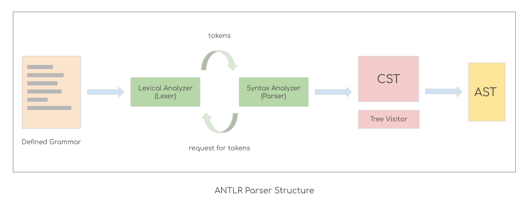

# Query Parser Introduction

---
## 1. Tool and Parser Structure

A good parsing tool is the key factor to make the query parsing process simple and maintainable. The SQL plugin now is using the ANTLR as the parsing tool and the constructed AST is served as the syntax tree for syntax anaysis and semantic analysis. And since the new parser is delivering more advantages than the old druid parser, which is difficult to maintain or to add more features into, the team is planning to migrate the parser totally to ANTLR and deprecate the druid in recent architecture migration project. Thus the PPL component also follows the path of the SQL component to apply ANTLR as the parsing tool to the module.

The ANTLR is a powerful tool to recognize and parse the custom grammar file that specifies a language. ANTLR can generate the parse tree according to the input grammar defined for PPL. Here we define a set of expression nodes that we prepare for the frontend module interface, and did some further processing to build a custom AST that suits the PPL specification well, like guiding the parse tree visitor from the tree nodes parsed from queries, to the expression nodes at the interface, and get the expression nodes all ready without any dependency on the parser module.

The basic structure of the ANTLR parsing tool consists of the grammar files that define the PPL specification, a lexer and a parser that interact with each other by tokens, and finally the AST after processing the tree nodes by modifying the tree visitor. The grammar files are storing the keywords or keyword patterns that might occur in the PPL queries, thus the lexer could recognize them as the tokens and send them to the parser for further processing. Then in the parser, the syntax nodes form the CST. By modifying the parse tree visitor, we can control the visitor to traverse along the designated route, get rid of meaningless components like the commas, parentheses etc. and deal the useful components to the AST nodes.